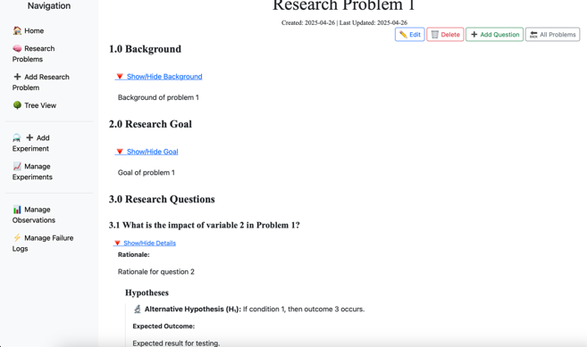
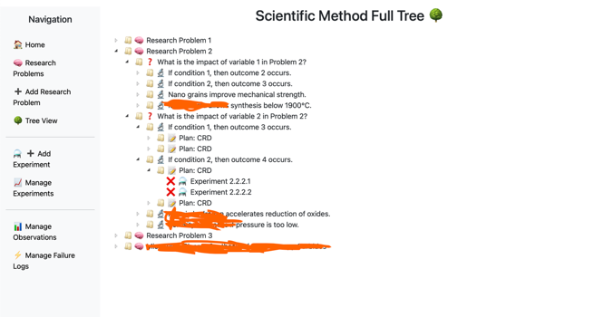

## 🧪 Introduction

As described in Chapter 5 of *Research Methodology and Scientific Writing* by Thomas (2021), experimental research is the foundation of scientific advancement, involving hypothesis formulation, experimental planning, controlled variable design, and empirical observation. These steps form the structured framework of the scientific method, ensuring logical progression from research problem to validated conclusions.

**SciMethod** is a Django-based research management system designed specifically to implement this structured methodology. It enables scientists, graduate researchers, and students to follow through every stage of experimental research—from ideation to data-backed conclusions—within a single, intuitive interface.

This application integrates tools to support each of the key components outlined in Thomas’s experimental research paradigm: identifying research problems, generating hypotheses, designing controlled experiments, logging variables, tracking failures, collecting observations, and analyzing results. Version control and markdown/LaTeX support ensure clarity, reproducibility, and transparency at all stages.

*Reference:*
Thomas, J. R. (2021). *Research Methodology and Scientific Writing*. Springer. Chapter 5.

# 🔬 SciMethod — Scientific Method Management System


SciMethod is a Django-based web application that helps researchers, scientists, and students plan, manage, and visualize the full cycle of the **scientific method** — from hypothesis formulation to experiment execution and observation analysis.

---

## 📦 Features

- ✅ CRUD operations for:
  - Research Problems
  - Research Questions
  - Hypotheses (with revisions)
  - Experimental Plans
  - Experiments
  - Variables & Observations
  - Failure Logs
- ✅ Version history tracking with undo support
- ✅ Markdown input for all major text fields (via `MDTextField`)
- ✅ LaTeX support via MathJax for rendering equations
- ✅ Tree View: Full interactive tree representation of all scientific elements
- ✅ Click-to-expand/collapse nested content
- ✅ Right-click context menus for quick edit/delete
- ✅ Printable, clean research views
- ✅ Seed script for sample data
- ✅ Mobile-friendly and responsive layout (Bootstrap 5)

---

## ⚙️ Setup Instructions

1. **Clone the repository**

```bash
git clone https://github.com/your-username/SciMethod.git
cd SciMethod
```

2. **Create virtual environment & install requirements**

```bash
python3 -m venv .venv
source .venv/bin/activate
pip install -r requirements.txt
```

3. **Configure static settings**

In `settings.py`:

```python
STATIC_URL = '/static/'
STATIC_ROOT = BASE_DIR / 'staticfiles'
```

Then run:

```bash
python manage.py collectstatic
```

4. **Apply migrations & run server**

```bash
python manage.py migrate
python manage.py runserver
```

5. **(Optional) Seed sample data**

```bash
python manage.py runscript seed_dummy_data
```

---

## 🧠 Usage

Visit: [http://localhost:8000](http://localhost:8000)

- **Homepage**: Overview of current scientific activity
- **Tree View**: Visual breakdown of Research → Questions → Hypotheses → Plans → Experiments
- **Detail Pages**: Click any item to view, edit, or add child elements

---

## 🧪 LaTeX & Markdown

All text fields accept **Markdown** with support for:

- Equations: `$E=mc^2$`, `$$\text{MoNbTaVW(C)}_5$$`
- Headings, bold, italic, lists, links, etc.

Rendered using:
- `Django MDEditor` for editing
- `MathJax` for rendering on detail pages

---

## 🔧 Dependencies

- Django 5.2+
- django-extensions
- django-mdeditor
- MathJax (via CDN)

---

## 🛡 License

This project is licensed under the [MIT License](LICENSE).

### 📌 Attribution Required

Any fork, deployment, or adaptation of this project must include a visible link back to the original GitHub repository:  
[https://github.com/MShirazAhmad/SciMethod](https://github.com/MShirazAhmad/SciMethod)

---

## 👨‍🔬 Author

**M. Shiraz Ahmad**  
Physics Department, University of Alabama at Birmingham  
Researcher in High-Entropy Ceramics & Plasma Processing  
GitHub: [https://github.com/MShirazAhmad/](https://github.com/MShirazAhmad/)

---

## 🤝 Contributions and Feedback

We welcome contributions! If you'd like to report bugs, request features, or submit enhancements:

- 🐛 Open an issue to report a bug or suggest a feature
- 🔀 Submit a pull request with your improvements on a separate branch
- 💬 Discuss your ideas via [GitHub Discussions](https://github.com/MShirazAhmad/SciMethod/discussions) (if enabled)

Please ensure all contributions maintain the structure and attribution of the original project.

---

## 💡 Screenshots


*Clean printable reading layout*


*Interactive tree structure with right-click options*

---

MIT License

Copyright (c) 2025 M. Shiraz Ahmad

Permission is hereby granted, free of charge, to any person obtaining a copy  
of this software and associated documentation files (the "Software"), to deal  
in the Software without restriction, including without limitation the rights  
to use, copy, modify, merge, publish, distribute, sublicense, and/or sell  
copies of the Software, and to permit persons to whom the Software is  
furnished to do so, subject to the following conditions:

The above copyright notice and this permission notice shall be included in all  
copies or substantial portions of the Software.

THE SOFTWARE IS PROVIDED "AS IS", WITHOUT WARRANTY OF ANY KIND, EXPRESS OR  
IMPLIED, INCLUDING BUT NOT LIMITED TO THE WARRANTIES OF MERCHANTABILITY,  
FITNESS FOR A PARTICULAR PURPOSE AND NONINFRINGEMENT. IN NO EVENT SHALL THE  
AUTHORS OR COPYRIGHT HOLDERS BE LIABLE FOR ANY CLAIM, DAMAGES OR OTHER  
LIABILITY, WHETHER IN AN ACTION OF CONTRACT, TORT OR OTHERWISE, ARISING FROM,  
OUT OF OR IN CONNECTION WITH THE SOFTWARE OR THE USE OR OTHER DEALINGS IN THE  
SOFTWARE.

---

SciMethod — Scientific Method Management System

Originally developed by M. Shiraz Ahmad  
GitHub: https://github.com/MShirazAhmad/SciMethod

This software is licensed under the MIT License.  
Any reuse or deployment must visibly attribute the original repository.
